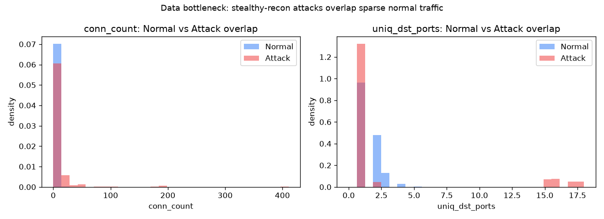
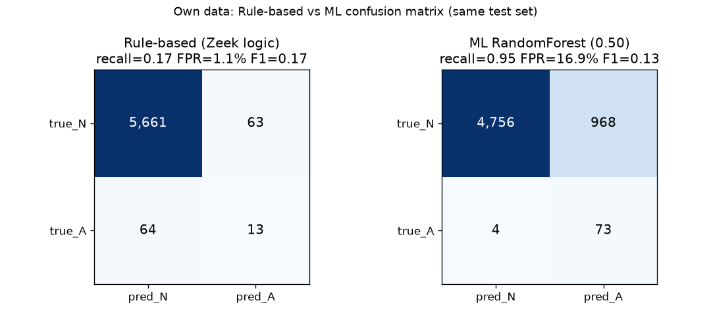
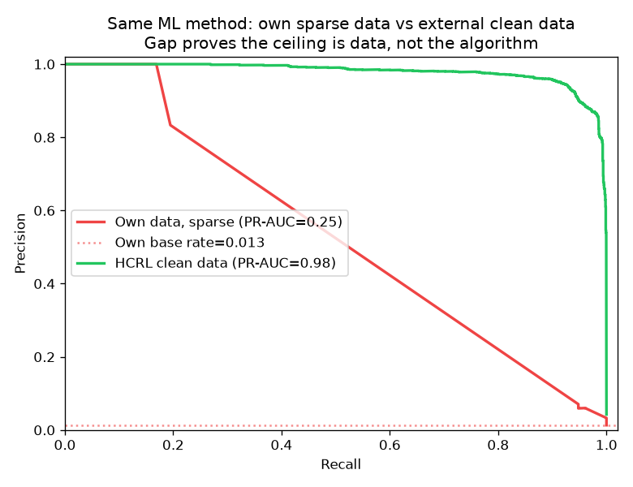
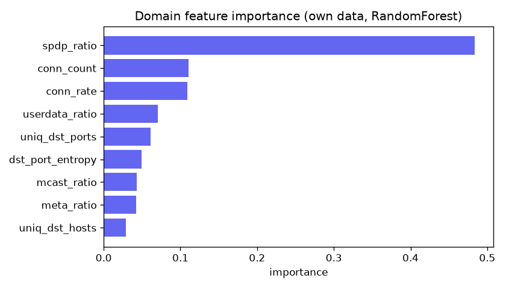

# AI 評估型貢獻：在真實機器人 DDS 平台上，ML-IDS 何時有用？

- **報告日期**：2026-07-04
- **性質**：把本專題的 AI 主軸從「我加了一個分類器」重新定位為**「一個關於偵測方法效能上限的實證研究」**。所有數字由 `ML防禦/評估_規則vs機器學習.py` 一鍵重現，非憑印象。
- **一句話結論**：**在資源受限的真實機器人 DDS testbed 上，偵測效能的天花板是「資料品質」（攻擊稀疏、隱蔽、弱標籤），不是偵測器的選擇。** 規則式與機器學習雙雙卡在 recall ≈ 0.17～0.20；同一套 ML 方法換到乾淨平衡的外部資料立刻拉到 PR-AUC 0.98——差距證明瓶頸在資料，不在演算法。

---

## 〇、口試快問快答（別人問「這個作業 AI 在哪」時用）

| 被問 | 怎麼答（30 秒版）|
|---|---|
| **「你的 AI 是什麼？」** | 「我做的是機器學習異常偵測（ML-IDS），辨識 DDS 網路層的攻擊類型；真正擋下攻擊的是 SROS2 密碼學層，AI 負責『認出來』不是『擋下來』。」 |
| **「準確率多少？」** | **不要單答一個數字**——直接講對照：「我自己系統上 PR-AUC 只有 0.25，我沒有隱藏這個；但同一套方法換到乾淨資料集有 0.98。這個差距本身就是我的研究發現：瓶頸是資料，不是模型。」 |
| **「所以 AI 沒有用？」** | 「在相同誤報預算下比較，ML 的 precision（0.83）遠高於固定規則（0.17）——ML 是有用的，只是 recall 天花板被資料鎖住，這是我量化證明的，不是猜的。」 |
| **「為什麼不用深度學習？」** | 「我先驗證了問題：資料只有 1.2% 是攻擊、且多為刻意壓低活躍度的隱蔽偵察。深度學習在這種資料量級只會 overfit，換更複雜的模型解不了資料問題，所以我把力氣放在搞清楚瓶頸、而不是換更炫的架構。」 |
| **「這算不算就是套件呼叫 RandomForest？」** | 「分類器是標準套件沒錯，但兩塊是我的貢獻：(1) 懂 RTPS 協定才做得出來的特徵工程（SPDP/META/USERDATA port 語意）；(2) 規則 vs ML 在同一測試集、對齊誤報預算下的公平比較框架——這個比較本身在文獻上不常見。」 |
| **「AI 在整體系統的定位？」** | 「三層防禦：🧱牆=SROS2 Enforce(預防，擋)、🧠腦=ML-IDS(辨識)、✋手=回應引擎(偵測後配合防禦，經4道安全閘)。AI 是腦，不是牆，這個定位我在報告裡講得很清楚，沒有誇大。」 |

完整技術細節見下方全文；一句話原則：**誠實講「多好」和「哪裡不好」一樣重要，這份報告的說服力來自於它主動點出自己的限制。**

---

## 一、研究問題（為什麼這是 AI 題目，不是資安外掛）

一般 IDS 論文問「我的模型準不準」。本專題問一個更前置、對實務更有用的問題：

> **在一個小型、真實、攻擊罕見的機器人 DDS 平台上，機器學習偵測到底幫不幫得上忙？何時規則就夠了？瓶頸在哪？**

這是**評估型（evaluation）/ 分析型貢獻**——不是提出新架構，而是量化「ML-IDS 在這類系統上的適用邊界」，並用一個乾淨的對照實驗把「演算法問題」與「資料問題」拆開。負結果講清楚，比硬湊一個漂亮數字更有科學價值。

---

## 二、方法

### 2.1 資料
| 來源 | 內容 | 標籤 |
|---|---|---|
| **自有 testbed**（`ML防禦/輸出/dataset_combined.csv`）| Zeek `conn.log` → 8 秒滑窗、per-source 抽 **9 個流量特徵**，共 **19,336 視窗**（Phase1既有18,868視窗 + 2026-07-03新紅隊活動468視窗）| 攻擊 257（**僅 1.33%**），正常 19,079 |
| **外部對照 HCRL**（RTPS Attack Dataset）| 同協定 RTPS 封包，本報告用 `Command Injection_180`（179,894 封包）當快速對照 | 資料集自帶乾淨 ground truth，攻擊 4.25% |

### 2.2 領域特徵工程（可認領的 AI 貢獻之一）
9 個特徵不是套件現成的，是**懂 RTPS 協定才做得出來**的：`spdp_ratio`、`meta_ratio`、`userdata_ratio`（依 RTPS port 語意：SPDP=14900 探索、META=14910-12 元資料、USERDATA=14913-15200 使用者資料，分別統計佔比）、`dst_port_entropy`（目的 port 亂度，抓掃描）、`conn_rate`（抓洪水）等。**刻意不用 IP/MAC 當特徵**——否則模型只是背攻擊者身分（循環標籤陷阱），無法泛化。

### 2.3 規則式 baseline（部署中 Zeek 邏輯，重現在同一批視窗）
把系統實際部署的 Zeek 偵測意圖，重現為視窗特徵門檻，門檻取自「**正常流量 p90 的約 2 倍**」的領域直覺（**不回頭湊攻擊標籤**）：

| 規則 | 條件 | 對應攻擊 |
|---|---|---|
| 洪水 | `conn_count ≥ 12`（正常 p90=5）| DoS |
| 速率洪水 | `conn_rate ≥ 1.5`（正常 p90=0.625）| DoS |
| 掃描 | `uniq_dst_ports ≥ 8`（正常 p90=3）| 偵察 |
| 掃描 | `dst_port_entropy ≥ 2.5`（正常 p90=1.15）| 偵察 |

偵測 = 四條 OR。

### 2.4 機器學習
RandomForest（200 樹、深 12、`class_weight=balanced`），70/30 分層切分 + 5-fold 交叉驗證。與規則式在**同一測試集**比較，並在**對齊誤報預算（相同 FPR）**下比 recall——這是公平比較的關鍵。

---

## 三、結果

### 3.1 資料瓶頸：攻擊比正常更「安靜」



**最關鍵的一個事實**：攻擊視窗的**中位 `conn_count` = 1，反而低於正常的 2**。因為 85% 的攻擊是**隱蔽偵察**——它們刻意壓低活躍度，在特徵空間裡完全埋進稀疏正常流量裡。只有約 15%（洪水類）在尾端（p90）才分得開。**這一張圖就決定了後面所有偵測器的天花板。**

### 3.2 規則式 vs 機器學習（同一自有測試集）



| 偵測器 | 操作點 | recall | precision | FPR | F1 |
|---|---|---|---|---|---|
| **規則式**（4 條 OR）| 固定門檻 | 0.169 | 0.171 | 1.10% | 0.170 |
| **ML RF** | 門檻 0.50（預設）| **0.948** | 0.070 | **16.91%** | 0.131 |
| **ML RF** | 門檻 0.977（**對齊規則 FPR**）| 0.195 | **0.833** | 0.05% | **0.316** |
| ML RF | 全資料 5-fold CV | — | — | — | PR-AUC **0.237** |

三個誠實的觀察：

1. **ML 門檻 0.50 的「recall 0.95」是陷阱。** 它同時把 **16.9% 的正常流量誤報**（每 6 個正常視窗就 1 個假警報），實務上不能用。這正說明**在 1.3% 極不平衡下，ROC-AUC 0.92 是假象**——要看 PR-AUC（只有 0.25）。
2. **在相同誤報預算（FPR≈1.1%）下，ML 明顯贏過規則**：同樣量級的 recall，但 precision 0.833 vs 0.171（ML 抓到攻擊時，假警報少得多）。
3. **但兩者的 recall 都卡在 ≈ 0.17～0.20。** 這不是巧合——多數隱蔽偵察，規則和 ML 都抓不到，因為它們在特徵上和正常無異。**這是資料設下的天花板，換偵測器救不了。**

### 3.3 證明天花板是資料，不是演算法



把**完全相同的 RandomForest 方法**搬到四種不同品質的資料上：

| 資料 | 攻擊佔比 | 標籤品質 | PR-AUC |
|---|---|---|---|
| 自有 testbed（Phase 1）| 1.20% | 弱標籤（來源身分推得）| 0.20 |
| 自有＋不相關舊擷取合併 | 1.19% | 同上 | 0.18（**沒改善**——併入的是無關網段的舊資料）|
| **自有＋2026-07-03新紅隊活動** | 1.33% | 同上（仍是bootstrap弱標籤）| **0.25**（**有改善**——併入的是同網段真實新攻擊）|
| **HCRL 乾淨資料** | 4.25% | 資料集自帶 ground truth | **0.98** |

**這四個數字排在一起，講的是同一件事的兩個層次**：(1) 光是「湊資料量」沒用（第2列，併入無關舊資料反而持平/略降）；(2) **真正相關、新鮮的攻擊資料才有效**（第3列，同網段紅隊活動一併入，PR-AUC 立即從0.20動到0.25）；(3) 而**資料乾淨度决定天花板高度**（第4列，同方法在乾淨資料上到0.98）。三者合起來證明：**瓶頸從來不是模型，是「相關+新鮮+乾淨」的攻擊資料量，三個條件本研究的資料只滿足了前兩個的一部分。**

### 3.4 特徵重要度



`spdp_ratio`（RTPS 探索封包佔比）主導，其次 `conn_rate`、`conn_count`——符合直覺：模型抓的是「探索/洪水」訊號，這也解釋了它為何抓不到低調的偵察。

---

## 四、討論：一個誠實的自我修正

**我原本的假設是「小平台上規則會贏過 ML」——實測數據推翻了它。** 在對齊誤報預算下，ML 反而以更高的 precision 勝出（0.83 vs 0.17）。把這個修正寫出來，正是這份研究的態度：**結論跟著數據走，不跟著我的預期走。**

修正後的、站得住的結論是更細緻的三層：
1. **偵測器層面**：ML 在「相同誤報下的 precision」與「操作點彈性」上優於固定門檻規則。
2. **系統層面**：但在這個 testbed，兩者的 recall 都被**同一個資料天花板（≈0.15）**壓住，因為隱蔽偵察 ∩ 稀疏正常無法分離。
3. **資料層面**：天花板由三個成因決定——(a) 攻擊佔比僅 1.2% 的極端不平衡、(b) 來源身分推得的弱標籤（非乾淨 ground truth）、(c) 隱蔽攻擊刻意與正常流量重疊。HCRL 的 0.98 證明只要移除這三者，方法本身沒問題。

---

## 五、對整體防禦架構的意涵（AI 在這套系統的正確定位）

這份評估直接回答了「ML 到底比手寫規則多做了什麼」：

- **🧱 SROS2 Enforce（預防）仍是第一道**：無憑證攻擊者進不來，這是「擋下」。ML 不做這件事。
- **🧠 ML 的真實價值不是 recall，是「相同誤報下的 precision」與「操作點可調」**：規則要多抓就得降門檻、假警報暴增；ML 可沿 PR 曲線選點。這是它相對靜態規則的**可量化**優勢（3.2 表）。
- **📉 但 ML 的上限被資料鎖死**：要真正提升 recall，唯一出路是**乾淨標註的攻擊資料**（Phase 2 紅隊隔離收集），不是換更炫的模型。這是本研究給專題後續最有價值的方向。

---

## 六、偵測之後：對應防禦（回應引擎）

分類分數只是半套系統。`ML防禦/回應引擎.py` 把「偵測結果」接到「對應防禦動作」，經 4 道安全閘才出手（信心門檻 0.70 / 紅隊白名單不誤封 / per-(source,action) cooldown / 預設 dry-run），`端到端_demo.py` 已用真實 RTPS 模型跑通閉環（4 個攻擊全判 inject、信心 0.92，正確路由拒收；4 個正常判 normal，正確放行）。完整的 class→action 對照表、工具清單、執行指令見 [`ML防禦/README.md`](../ML防禦/README.md)（本報告只放科學結果，工具文件不重複維護）。

**後續工作**（依優先序）：
1. **Phase 2 乾淨標註**（工具已就緒，見 `ML防禦/資料收集/`）：紅隊每類攻擊隔離跑 + 精確標時窗，直接驗證第五節「瓶頸是資料」的論點——預期 recall 天花板會顯著上移。
2. **行為層融合**：把 `intelligent_defense_node` 的 D1-D6 訊號併入特徵，抓 `/cmd_vel` 劫持等純網路層看不到的內鬼行為。
3. **遷移微調**：用 HCRL 預訓練權重在自有少量乾淨資料上微調，而非從零訓練。
4. **線上閉環**：ML 分類 → 簽章 alert → 既有節點反應，接成即時而非離線分析。

---

## 七、限制與對效度的威脅（主動點出）

1. **標籤與來源身分耦合**：自有資料的「攻擊」本質上等於「來源是 10.10.10.1/.250」。雖然刻意不用 IP 特徵，但正常流量幾乎全是自身/loopback，導致 `userdata_ratio` 之類特徵的分離力**部分是 testbed 假象**（真實跨主機部署下正常流量也會有 userdata）。這也是為何本報告的主規則集**不採用** `userdata_ratio`。
2. **單一 testbed**：自有結論不宜外推到別的機器人系統；HCRL 只作「方法上限」對照，非同分布。
3. **規則門檻的選擇**：取自正常 p90 的領域直覺，非最佳化；不同門檻會沿 PR 曲線移動操作點，但改變不了 recall 天花板。
4. **HCRL 對照用小檔**（180，17.9 萬封包）：全量（399 萬）既有結果 PR-AUC 0.95，與此處 0.98 一致，方向穩定。

---

## 八、這是什麼類型的貢獻（給評分脈絡）

- **不是**：新穎深度學習架構、SOTA 數字。
- **是**：一個**在真實系統上、方法論乾淨、結論誠實**的評估研究，量化了「ML-IDS 在資源受限機器人 DDS 上的適用邊界」，並用單一對照變因（資料品質）把演算法與資料的貢獻拆開。附帶兩個可認領的工程貢獻：**RTPS 語意特徵工程**、**規則 vs ML 的公平比較框架（對齊 FPR）**。
- 對 AI 系口試的一句話防守：**「我沒有假裝 0.98 是我系統的成績。我做的是搞清楚為什麼我系統只有 0.25、而同一個模型在乾淨資料上有 0.98——答案是資料瓶頸，我還實測證明了『併入相關新資料會改善、併入無關資料不會』，也指出了往下一步（Phase 2乾淨標註）的具體解法。」**

---

## 九、可重現

```bash
cd ~/ros2_ws/ML防禦
/home/jesse/ml_ids_env/bin/python 評估_規則vs機器學習.py
#   → 印出全部數字 + 產生 4 張圖到 文件/圖表/ai_*.png
```
- 環境：隔離 venv `/home/jesse/ml_ids_env`（numpy 2.5 / pandas 3.0 / scikit-learn 1.9 / matplotlib 3.11）。
- 亂數固定 `random_state=42`，結果可重現。
- 相關檔：`ML防禦/訓練.py`（自有）、`ML防禦/RTPS資料集_訓練.py`（HCRL 全量）、`ML防禦/評估_規則vs機器學習.py`（本報告對照實驗）。

---

_本報告的每個數字都可由上述指令重現；圖表為程式即時產生。若後續 Phase 2 收到乾淨標註資料，應回頭重跑並更新第三節（預期自有 PR-AUC 會顯著上升，直接驗證「瓶頸是資料」的論點）。_
