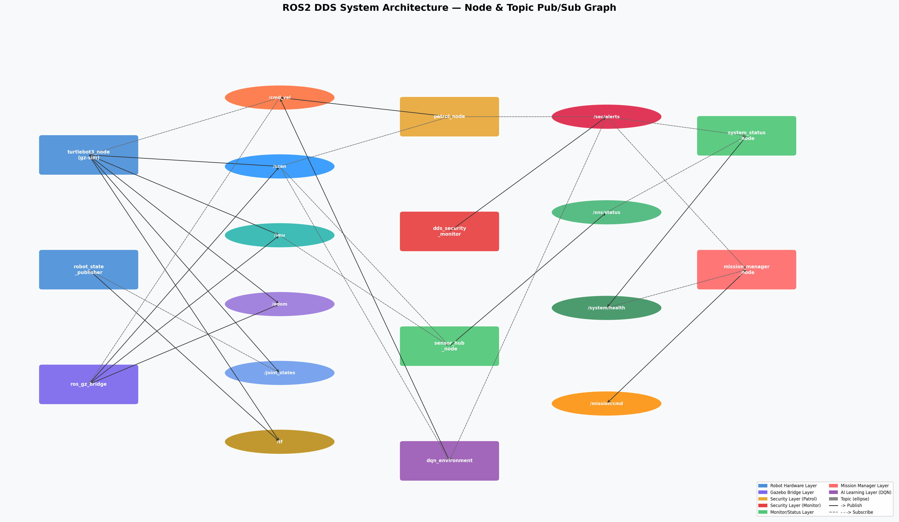

# ROS2 DDS 節點與 Topic 規格書

> **版本：TQC + HMAC envelope v3 + 行為 IDS。** 本文件已從舊版（SAC / dqn_environment / 376 維 / 純文字警報）更新。
> 最新、最完整的規格以 [紅隊測試/ARCHITECTURE.md](../../紅隊測試/ARCHITECTURE.md)、[紅隊測試/系統威脅分析.md](../../紅隊測試/系統威脅分析.md) 為準（含介面清單與簽章狀態）。
>
> 所有規格直接從原始碼提取，非推測。  
> 圖例：**矩形 = 節點（Node）　橢圓 = Topic　實線 = Publish　虛線 = Subscribe**



---

## 第一章　節點規格（矩形）

節點之間**無直接函式呼叫**，所有資料交換皆透過 DDS Topic。

> 註：本表列出核心節點。完整防禦堆疊另含 `intelligent_defense_node`（行為 IDS，
> 訂閱 /cmd_vel /scan /odom /security/heartbeat，D1–D6 偵測 + cascade 斷路器），
> 詳見 [紅隊測試/ARCHITECTURE.md](../../紅隊測試/ARCHITECTURE.md)。

---

### A 層：模擬橋接層

#### `turtlebot3_node`
| 項目 | 內容 |
|---|---|
| 來源 | TurtleBot3 官方套件 |
| 職責 | 機器人底層控制。將速度指令轉換為差速輪馬達 PWM；讀取編碼器回饋發布關節狀態 |
| 訂閱 | `/cmd_vel`（TwistStamped）— 取 linear.x、angular.z 驅動兩輪 |
| 發布 | `/joint_states`（JointState）— 左右輪角度（rad）與角速度（rad/s）|
| 核心邏輯 | 差速輪運動學：`v_L = linear − angular × L/2`；`v_R = linear + angular × L/2` |

#### `robot_state_publisher`
| 項目 | 內容 |
|---|---|
| 來源 | ROS2 官方套件 |
| 職責 | 讀取 URDF + 即時關節角度，以正向運動學（FK）計算各連桿空間位置，持續廣播 TF 樹 |
| 訂閱 | `/joint_states`（JointState）— 取左右輪角度計算里程 |
| 發布 | `/tf`（TFMessage）— 完整 TF 樹：`odom → base_footprint → base_link → base_scan / imu_link` |
| 核心邏輯 | TF 樹讓任意兩坐標系之間的位置向量轉換無需各節點自行處理幾何 |

#### `ros_gz_bridge`
| 項目 | 內容 |
|---|---|
| 來源 | `ros_gz_bridge` 套件（Gazebo Garden 官方橋接）|
| 職責 | Gazebo Protobuf ↔ ROS2 訊息格式的雙向即時轉換器 |
| 訂閱 | `/cmd_vel`（TwistStamped）— 轉為 Gazebo 格式送入模擬器控制器 |
| 發布 | `/scan`（LaserScan）、`/imu`（Imu）、`/odom`（Odometry）|
| 核心邏輯 | 橋接規則設定於 `gazebo.launch.py`，每條規則指定 topic 名稱、方向（GZ→ROS / ROS→GZ）與訊息型別對應 |

---

### B 層：資安監控層

#### `dds_security_monitor`
| 項目 | 內容 |
|---|---|
| 來源 | `monitor_node.py`（本專題自製）|
| 職責 | 資安核心。輪詢 DDS Domain 的節點圖，比對白名單，發現未知節點立即觸發多層應變 |
| 訂閱 | 無（直接呼叫 `get_node_names_and_namespaces()` API，不透過 Topic）|
| 發布 | `/security/alerts`（String，**HMAC envelope v3 簽章**，RELIABLE+VOLATILE）— 內含 channel=CH_ALERTS + ts + nonce + payload + sig |
| | `/security/heartbeat`（String，envelope v3）— 每 2 秒，給 intelligent_defense_node 的 D5 watchdog 判活 |
| 核心邏輯 | 每 5 秒快照節點圖 → 比對 11 節點白名單（baseline+grace，敏感參數 read_only）→ 不符者：① 簽章發布警報 ② LINE 30s batch 推播。緊急停止由各下游模組**驗章後**自行執行（resume 30s 固定不 reset，90s 內≥2 次 → 120s quiet window）|

---

### C 層：任務協調層

#### `sensor_hub_node`
| 項目 | 內容 |
|---|---|
| 來源 | `sensor_hub_node.py`（本專題自製）|
| 職責 | 感測器資料的第一道處理站，將原始訊號萃取為語意化特徵後向上廣播 |
| 訂閱 | `/scan`（LaserScan）— 取 360 射線的最小有效距離，作為最近障礙物距離 |
| | `/imu`（Imu）— 計算 `√(ax²+ay²)` 得水平合加速度，代表碰撞強度 |
| 發布 | `/sensor/status`（String，1 Hz）— 含距離、安危判斷、加速度 |
| 核心邏輯 | 最近距離 < 0.35 m → 標記「⚠️ 危險」；否則「✅ 安全」|

#### `mission_manager_node`
| 項目 | 內容 |
|---|---|
| 來源 | `mission_manager_node.py`（本專題自製）|
| 職責 | 任務狀態機。整合感測器與資安狀態，輸出統一任務模式，讓執行層無需各自判斷複雜條件 |
| 訂閱 | `/sensor/status`（String）— 含「⚠️ 危險」→ AVOID_OBSTACLE |
| | `/security/alerts`（String，RELIABLE+TRANSIENT_LOCAL）— 收到即切換 EMERGENCY_STOP |
| 發布 | `/mission/cmd`（String，1 Hz）— 枚舉：`PATROL` / `AVOID_OBSTACLE` / `EMERGENCY_STOP` |
| 核心邏輯 | 正常 → PATROL；障礙 → AVOID_OBSTACLE；警報 → EMERGENCY_STOP（最高優先，30 秒後自動解除）|

#### `system_status_node`
| 項目 | 內容 |
|---|---|
| 來源 | `system_status_node.py`（本專題自製）|
| 職責 | 系統監控出口。訂閱所有狀態 Topic，合成單一健康報告，操作者只需監看一個 Topic |
| 訂閱 | `/sensor/status`、`/mission/cmd`、`/security/alerts`（後者 RELIABLE+TRANSIENT_LOCAL）|
| 發布 | `/system/health`（String，0.5 Hz）— 三欄：感測器狀態 / 當前任務 / 資安狀態 |
| 核心邏輯 | 收到資安警報後，健康報告的資安欄位保持 🚨 狀態 30 秒（即使警報已停止）|

---

### D 層：巡邏與強化學習層

#### `patrol_node`
| 項目 | 內容 |
|---|---|
| 來源 | `patrol_node.py`（本專題自製）|
| 職責 | 規則式自主巡邏，以反應式架構（Reactive Architecture）運作，無需地圖或路徑規劃 |
| 訂閱 | `/scan`（LaserScan）— 前方 ±20° 判斷障礙；左右 30°–90° 決定轉向 |
| | `/security/alerts`（String，RELIABLE+TRANSIENT_LOCAL）— 收到立即停止 30 秒 |
| 發布 | `/cmd_vel`（TwistStamped，10 Hz）— 前進 ±0.20 m/s；轉彎 ±0.8 rad/s |
| 核心邏輯 | 障礙持續 > 1.5 秒（STUCK_TICKS=15）→ 切換後退模式 1.0 秒（BACKUP_TICKS=10）再繼續 |

#### `burger_env_top`（TQC 訓練環境）
| 項目 | 內容 |
|---|---|
| 來源 | `burger_env_top.py`（本專題自製）|
| 職責 | TQC（Truncated Quantile Critics）強化學習的 Gym 環境介面，將 ROS2 感測器訊號轉為 RL 觀測向量，模型動作轉為速度指令，並計算 potential-based 即時獎勵 |
| 訂閱 | `/scan`（LaserScan）— 180 raw beams，歸一化後經 1D-Conv encoder |
| | `/odom`（Odometry）— 取 (x,y) 算到巡邏點距離；取 yaw 算朝向誤差 |
| | `/security/alerts`（String，envelope v3，RELIABLE+VOLATILE）— 驗章通過則終止回合 |
| 發布 | `/cmd_vel`（TwistStamped）— linear.x ∈ [0, +0.22] m/s（Burger 物理上限）；angular.z ∈ [−1.5, +1.5] rad/s |
| 核心邏輯 | 觀測向量：(180 LiDAR beams + 6 state) × frame stack K=4 = **744 維**；Reward = γ·Φ(s')−Φ(s)（Ng-Harada-Russell 1999）；curriculum 1→5 + Domain Randomization + 5% 對抗訓練 |

---

## 第二章　Topic 規格（橢圓，共 10 個）

10 個 Topic 依功能分為四組：**感測器** / **控制** / **任務狀態** / **資安警報**。

---

### 第一組　感測器原始資料（A 層產生，不含決策）

| Topic | 傳什麼 | 發布者 → 訂閱者 | 頻率 | QoS |
|---|---|---|---|---|
| `/scan` | 360° 雷射距離陣列（0.12–3.50 m）| ros_gz_bridge → sensor_hub、patrol、burger_env_top、intelligent_defense | 5 Hz | BEST_EFFORT |
| `/imu` | 三軸加速度、角速度、姿態四元數 | ros_gz_bridge → sensor_hub | 50 Hz | BEST_EFFORT |
| `/odom` | 機器人位置 (x,y)、朝向 yaw、速度 | ros_gz_bridge → burger_env_top、patrol、intelligent_defense | 30 Hz | BEST_EFFORT |
| `/joint_states` | 左右輪角度（rad）與角速度 | turtlebot3_node → robot_state_publisher | 30 Hz | RELIABLE |
| `/tf` | 坐標系轉換樹（odom→base_link→base_scan…）| robot_state_publisher → 所有節點 | 100 Hz | RELIABLE |

**各節點怎麼用 `/scan`：**
- `sensor_hub`：取 360 點最小值 → 最近障礙距離
- `patrol`：前方 ±20° 判斷有無障礙；左右 30–90° 決定轉向方向
- `burger_env_top`：取 180 raw beams 歸一化，經 1D-Conv encoder 作為 RL 觀測主體

**`/odom` 在 RL 裡的用法：**  
距離 `d = √((x−wx)²+(y−wy)²)`；朝向誤差 `Δθ = arctan2(wy−y, wx−x) − yaw`，組成觀測向量後 4 維。

**感測器類選用 BEST_EFFORT 的原因：** 寧可丟一幀，不等重傳。時效性比完整性重要。

---

### 第二組　機器人控制

| Topic | 傳什麼 | 發布者 → 訂閱者 | 頻率 | QoS |
|---|---|---|---|---|
| `/cmd_vel` ⚠️ | 前進速度 linear.x（m/s）+ 轉向 angular.z（rad/s）| patrol、burger_env_top → turtlebot3_node | 10 Hz | RELIABLE |

**各情境數值：**

| 情境 | linear.x | angular.z |
|---|---|---|
| 正常前進 | +0.20 | 0.0 |
| 卡住後退 | −0.20 | 0.0 |
| 轉彎迴避 | 0.0 | ±0.8 |
| 緊急停止 | 0.0 | 0.0 |
| RL（TQC）輸出 | [0, +0.22] | [−1.5, +1.5] |

> ⚠️ 多節點可發布，最後到達者生效（Last-Write-Win）。`/cmd_vel` 非 String 無法簽章，改由 `intelligent_defense_node` 行為偵測（D1/D4/D6）緩解；根治需 SROS2 Enforce。

---

### 第三組　任務狀態（C 層消化後的語意結果，不直接控制機器人）

| Topic | 傳什麼 | 發布者 → 訂閱者 | 頻率 | QoS |
|---|---|---|---|---|
| `/sensor/status` ⚠️ | 障礙距離 + 安危判斷 + 水平加速度（字串）| sensor_hub → mission_manager、system_status | 1 Hz | RELIABLE |
| `/mission/cmd` | 任務模式枚舉（字串）| mission_manager → system_status | 1 Hz | RELIABLE |
| `/system/health` | 三欄健康報告（感測器/任務/資安）| system_status → 操作者 | 0.5 Hz | RELIABLE |

**`/sensor/status` 內容範例：**
```
"[感測器狀態] 最近障礙物: 0.45m | ✅ 安全 | 水平加速度: 0.12m/s²"
"[感測器狀態] 最近障礙物: 0.18m | ⚠️ 危險 | 水平加速度: 0.34m/s²"
```

**`/mission/cmd` 三種狀態：**

| 值 | 觸發條件 |
|---|---|
| `PATROL` | 正常，無障礙無警報 |
| `AVOID_OBSTACLE` | 感測距離 < 0.35 m |
| `EMERGENCY_STOP` | 收到資安警報，持續 30 秒 |

> ⚠️ `/sensor/status` 用字串比對 `"⚠️ 危險"` 做決策（String Anti-Pattern）。格式改動將靜默失效，未來應改用自訂 `.msg` 傳數值。

---

### 第四組　資安警報（B 層專屬，觸發全系統應變）

| Topic | 傳什麼 | 發布者 → 訂閱者 | 頻率 | QoS |
|---|---|---|---|---|
| `/security/alerts` | **HMAC envelope v3 簽章字串**（channel=CH_ALERTS + ts + nonce + payload + sig）| monitor、intelligent_defense → patrol、mission_manager、system_status、burger_env_top | 事件觸發 | **RELIABLE + VOLATILE（max_age 3s）** |
| `/security/heartbeat` | envelope v3 簽章心跳 | monitor → intelligent_defense | 2 Hz | RELIABLE + TRANSIENT_LOCAL |

**收到警報後各節點的反應（皆先 `verify_alert` 驗章，通過才動作）：**

| 訂閱者 | 立即動作 | 解除條件 |
|---|---|---|
| `patrol` | 停止移動 | 30 秒後自動恢復（timer 固定不 reset；90s 內≥2 次 → 120s quiet window） |
| `mission_manager` | 切換 EMERGENCY_STOP | 30 秒後恢復 PATROL |
| `system_status` | 健康報告標記 🚨 | 30 秒後清除 |
| `burger_env_top` | 終止 episode | 本 episode 結束 |

**為何用 RELIABLE + VOLATILE（而非 TRANSIENT_LOCAL）：**  
RELIABLE 確保警報不因網路擁堵被丟棄；改用 VOLATILE 是為了**防重放** —— TRANSIENT_LOCAL 會把最後一筆警報 latch 給晚啟動的訂閱者，反而讓攻擊者可重放舊警報造成永久停車（紅隊 N3）。anti-replay 改由 envelope v3 的 ts + nonce + 接收端 ReplayCache 保證。心跳則仍用 TRANSIENT_LOCAL（擋 BEST_EFFORT 假冒 publisher）。

---

## 第三章　節點 × Topic 矩陣

| | `/scan` | `/imu` | `/odom` | `/joint_states` | `/tf` | `/cmd_vel` | `/sensor/status` | `/mission/cmd` | `/security/alerts` | `/system/health` |
|---|:---:|:---:|:---:|:---:|:---:|:---:|:---:|:---:|:---:|:---:|
| `turtlebot3_node` | | | | **PUB** | | SUB | | | | |
| `robot_state_publisher` | | | | SUB | **PUB** | | | | | |
| `ros_gz_bridge` | **PUB** | **PUB** | **PUB** | | | SUB | | | | |
| `dds_security_monitor` | | | | | | **PUB** | | | **PUB** | |
| `sensor_hub_node` | SUB | SUB | | | | | **PUB** | | | |
| `mission_manager_node` | | | | | | | SUB | **PUB** | SUB | |
| `system_status_node` | | | | | | | SUB | SUB | SUB | **PUB** |
| `patrol_node` | SUB | | | | | **PUB** | | | SUB | |
| `burger_env_top` | SUB | | SUB | | | **PUB** | | | SUB | |
| `intelligent_defense_node` | SUB | | SUB | | | SUB | | | **PUB** | |

---

## 第四章　已知架構缺陷

| # | 缺陷 | 影響 Topic | 狀態 |
|---|---|---|---|
| 1 | 字串解析反模式 | `/sensor/status` 等 | 待重構（低優先） |
| 2 | `/cmd_vel` 無優先權仲裁 | `/cmd_vel` | 🟡 行為 IDS 緩解 |
| 3 | `/security/alerts` 無身份驗證 / 可重放 | `/security/alerts` | ✅ 已修補（envelope v3） |

### 缺陷 1：字串解析反模式
`mission_manager` 以字串比對 `"⚠️ 危險"` 做決策，格式改動將靜默失效。  
**正解**：自訂 `.msg`，傳 `uint8 status`（0=SAFE / 1=WARNING / 2=CRITICAL）與 `float32 min_distance_m`。

### 缺陷 2：`/cmd_vel` 無優先權仲裁
`/cmd_vel` 訊息型別非 String，無法包 HMAC envelope；多 publisher 競爭（Last-Write-Win），緊急停止可能被高頻注入覆蓋（紅隊 N9）。  
**現狀**：由 `intelligent_defense_node` 行為偵測緩解 —— D1 物理門檻（>0.23 m/s）、D4 unauthorized publisher、D6 cmd-vs-odom 一致性；patrol pause 期間高頻送 0 速度競爭（N9 約 62% 緩解）。**根治需 SROS2 Enforce**（列入 90 天計畫）。

### 缺陷 3：`/security/alerts` 無身份驗證 / 可重放 ✅ 已修補
原設定為**純文字、無簽章**，任何同 domain 節點可偽造警報強制停車（紅隊 B），且可錄製合法警報無限重放造成永久停車（紅隊 N3）。  
**已修補**：改用 **HMAC envelope v3**（channel + ts + nonce + payload + sig）；接收端 `verify_alert` 五道檢查 + ReplayCache；QoS 改 RELIABLE+VOLATILE+max_age 3s（防 TRANSIENT_LOCAL latch 被重放）。紅隊 N1/N3/N4 回測已確認擋下。
